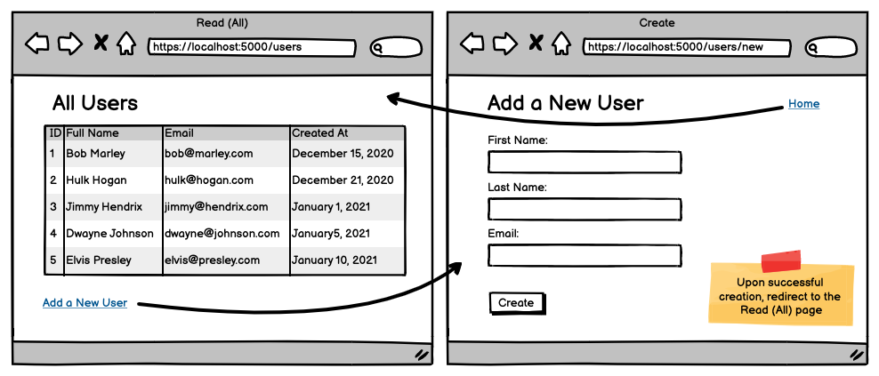

# Users CR

## Coding Dojo Practice 07.09.2022

  

 

 

 

## **Step:**
* Use the users_schema created in the MySQL course
* Create a new Flask project
* Create 2 html pages, Read (All) and Create
* Display all users from the database on the Read (All) page
* Display form to create new users on the Create page
* When the form is submitted, a new user should be inserted into the database
* Redirect to Read (All) page after creating a new user, and the user just created should appear in the table
